<a name="title"></a>
# Introduction to Building Windows Store Apps with Microsoft Azure Mobile Services #

---
<a name="Overview"></a>
## Overview ##
In this HOL, you will create a Mobile, Logic, API and Web App as part of an integrated solution.  The Mobile App will connect to a SQL Database instance and store Todo items in the database.  The Logic App will poll the database for new records and start a workflow instance for each new table record.  The API App will be used in the Logic App to store workflow data to an DocumentDB instance.  Finally, the Web App will host a WebJob that asynchronously notifies you when a workflow has finished processing data.

<a name="Objectives"></a>
### Objectives ###
- Create a Logic App workflow using both API Apps and built-in connectors
- Create a Mobile App instance and integrate the service with a Windows Store application
- Create a custom API App instance and use it in a Logic App
- Create a WebJob hosted in a Web App instance.

<a name="technologies"></a>
### Prerequisites ###

- Microsoft Azure subscription [Create a Microsoft Azure account and enable preview features](http://www.windowsazure.com/en-us/develop/mobile/tutorials/create-a-windows-azure-account/)
- [Azure SDK 2.6](http://azure.microsoft.com/en-us/downloads/)
- [Visual Studio 2015 Community Edition](http://www.microsoft.com/visualstudio)
  > You must have a release or RTM version of Visual Studio 2015.  Visual Studio 2015 RC does not currently support creating template API Apps.

<a name="Exercises"></a>
## Exercises ##

This hands-on lab includes the following exercises:

1. [Creating your Mobile App](#Exercise1)
1. [Create your API App](#Exercise3)
1. [Create your Logic App](#Exercise2)
1. [Create your Web App & WebJob](#Exercise4)
1. [Test Your Solution](#Exercise5)

<a name="Exercise1"></a>
## Exercise 1: Creating your Mobile App ##

In this exercise, you will create a mobile service and application using the TodoItem template.

1. Log into the [Microsoft Azure Management Portal](https://portal.azure.com) and navigate to Mobile Services.

1. In the top left of the window, click **+NEW**. Click the **Web + Mobile** option and click the **Mobile App** item.

   

2. Type a unique **Name** for your Mobile App..

7. Select any **Location**. In this tutorial, we used **South Central US**.

3. Select your subscription.

6. Create a new App Service Plan with the name **EndToEnd** for your App Service apps.  Ensure that the App Service Plan is at the **S1 Standard** pricing tier.

4. Create a new resource group with the name **EndToEnd** for your App Service apps.

  > You must create a new App Service Plan in order to have the option to create a new resource group.  Please ensure that you create a new plan and resource group that are unique for this lab.  This lab will assume that you use the name **EndToEnd** for both your plan and group.

5. In **Package Settings**, select **USERDATABASE**, you can choose an existing database or create a new one. For creating a new database, type the name of the new **database**, create a new **server**, type the name of that server, then choose a **login name**, which is the administrator login name for the new SQL Database server, type and confirm the password, and click the ok button to complete the process. If selecting an existing database, you will need to provide a **Server Administrator Password**.

   

8. Select a Pricing Tier. In this tutorial, we use **Basic 1**.

   Your new mobile app settings page will now look something like this:

   

9. Click the **Create** button at the bottom of the blade and you should see it starting deployment in the notifications window.

10.  Click the **Browse** button.

1. Click **Mobile Apps**, and then click the mobile app that you just created.

2. Click the **Mobile App Code** tile.

2. At the top of the Mobile App Code blade, click **Get Publish Profile** and download your publish profile.  Save this somewhere where you can easily find later.

2. At the top of the Mobile App blade, click **Add Client** and expand **Windows (C#)**.

   

3. Download and Save both the **Server Project** and the **Windows Project**.

1. On your Windows PC, extract both projects you downloaded earlier, and then open them both in Visual Studio.  One project will have an suffix of **_Windows_CS**.  This is a Windows Universal App project using XAML and C# that's already preconfigured to connect to your Mobile App.  The other project will have an suffix of **_Runtime**.  This project represents the app code for the Mobile App itself.

> You may need to unblock the compressed files (zip) since they were downloaded from the internet.

2. Open the **Runtime** solution in Visual Studio.

3. Open the **DataObjects/TodoItem** file.

4. Within the existing namespace, replace the entire **TodoItem** class with the following code:

  > It is important that you keep the namespace intact as the namespace will vary if you used a different name for your project.

        using Microsoft.Azure.Mobile.Server;

        public class TodoItem : EntityData
        {
            public string Text { get; set; }

            public bool Complete { get; set; }

            public bool Processed { get; set; }
        }

3. Right-click the project in the solution and click the **Publish** option.

4. Under **publish target** Select **Import**.  Choose your previously saved Publish Profile.  Finally, click **Publish**.

5. Close the **Runtime** solution in Visual Studio.

2. Open the **Windows_CS** solution in Visual Studio.

> You may need to aquire a Windows Store developer license.  Simply sign in with any Microsoft Account.

3. Set the **Windows Store** app to be your Startup Project.

4. Press **F5** to debug your Windows Store application.

  

5. Add a new TodoItem item.  You can close the application at any time.

6. Stop the debugging of the Windows Store application.

<a name="Exercise2"></a>
## Exercise 2: Creating your API App ##

In this exercise you will create a DocumentDB instance and an API App instance.  The API App will store any records received using an HTTP POST request to the DocumentDB instance.

1.	Sign in to the [Microsoft Azure Preview portal](https://portal.azure.com/).
2.	In the Jumpbar, click **New**, then select **Data + storage**, and then click **DocumentDB**.

	

3. In the **New DocumentDB** blade, specify the desired configuration for the DocumentDB account.

	

4. In the **Id** box, enter a unique name to identify the DocumentDB account.

5. In **Resource group**, select the existing **EndToEnd** resource gorup.

6.	Once the new DocumentDB account options are configured, click **Create**.  It can take a few minutes for the DocumentDB account to be created.  To check the status, you can monitor the progress on the Startboard or the Notifications hub.

	

	

5.	After the DocumentDB account has been created, it is ready for use with the default settings. Note that the default consistency of the DocumentDB account is set to Session.  You can adjust the default consistency setting via the [Azure Preview portal](https://portal.azure.com/#gallery/Microsoft.DocumentDB).

      

6. Now navigate to the Keys blade of your DocumentDB account as we will use these values in the API App we create next.

     

 2. In the Jumpbar, click **New**, then click **Web + Mobile > API App**.

 	

 4. Enter a unique value for **Name**.

 5. Ensure that the **App Service Plan** is set to **EndToEnd**.

 	

 6. Click **Create**.

 	

   > If you left the **Add to Startboard** check box selected, the portal automatically opens the blade for your API app after it's created. If you cleared the checkbox, click **Notifications** on the portal home page to see the API app creation status, and click the notification to go to the blade for the new API app.

 7. Click **Settings > Application Settings**.

 9. Set the Access level to **Public (anonymous)**.

 11. Click **Save**.

 	

1. Open Visual Studio. From the **File** menu, hover over the **New** option and click **Project**.

	

    _New Project in File menu_

2. In the **New Project** dialog box, expand **C#** and select **Web** under **Installed Templates**, and then select **ASP.NET Web Application**.

3. Name the application **ContactsList** and click **OK**.

	

    _New Project dialog box_

4. In the **New ASP.NET Project** dialog, select the **Azure API App (Preview)** project template.

	

    _New API App_

5. In Solution Explorer, right-click the project and then click **Manage NuGet Packages**.

6. In the **Search Online** box, type **Azure DocumentDB**.

  

7. From the results, install the **Microsoft Azure DocumentDB Client Library** package. This will download and install the DocumentDB package as well as all dependencies, like **Newtonsoft.Json**.

5. In Solution Explorer, right-click the project and then select **Add** and then click **Existing Item**.

6. Navigate to the **source** folder for this lab and add both the **TodoItem.cs** and **DocDbRepository.cs** files.

7. Open the **Web.config** file of your application and add the following lines within the **<appSettings>** XML element.

        <add key="endpoint" value="enter the URI from the Keys blade of the Azure Preview portal"/>
        <add key="authKey" value="enter the PRIMARY KEY, or the SECONDARY KEY, from the Keys blade of the Azure  Preview portal"/>
        <add key="database" value="ToDoList"/>
        <add key="collection" value="Items"/>

8. Update the values for endpoint and authKey using the Keys blade of the Azure Preview portal. Use the **URI** from the Keys blade as the value of the endpoint setting, and use the **PRIMARY KEY**, or **SECONDARY KEY** from the Keys blade as the value of the authKey setting.

4. In Solution Explorer, expand the **Controllers** folder and then delete the **ValuesController.cs** file.

5. In Solution Explorer, right-click the **Controllers** folder, and select **Add > Controller**.

	

6. In the **Add Scaffold** dialog, select the **Web API 2 Controller - Empty** option, and click **Add**.

	

7. Name the controller **ItemsController**, and click **Add**.

	

8. Within the existing namespace, replace the entire **ItemsController** class with the following code:

  > It is important that you keep the namespace intact as the namespace will vary if you used a different name for your project.

        using System.Threading.Tasks;
        using System.Web.Http;

        public class ItemsController : ApiController
        {
            [HttpPost]
            public async Task<IHttpActionResult> Post(Models.TodoItem item)
            {
                var document = await DocumentDB.Repository<Models.TodoItem>.CreateItemAsync(item);

                return Ok(document.Id);
            }
        }

9. In Solution Explorer, right-click the project and click **Publish**.

  

10. Click the Profile tab and click Microsoft Azure API Apps (Preview).

  

11. Select your recently created API App from the **Existing API Apps** list.  Click **Publish**.

  

<a name="Exercise3"></a>
## Exercise 3: Creating your Logic App ##

In this exercise, you will create a service bus queue, api app connectors and a logic app that listens to your SQL database created with your Mobile App and then triggers a workflow that calls your API app and then adds your Todo item to the service bus queue.

1. Log on to the [Classic Azure Management Portal](https://manage.windowsazure.com).

  > Service Bus is not yet available in the latest Azure portal.

2. In the left navigation pane of the Management Portal, click **Service Bus**.
3. In the lower pane of the Management Portal, click **Create**.

	

4. In the **Add a new namespace** dialog, enter a namespace name. The system immediately checks to see if the name is available.

	

5. After making sure the namespace name is available, choose the country or region in which your namespace should be hosted (make sure you use the same country/region in which you are deploying your compute resources).

6. Leave the other fields in the dialog with their default values (**Messaging** and **Standard Tier**), then click the check mark. The system now creates your namespace and enables it. You might have to wait several minutes as the system provisions resources for your account.

	

1. In the left navigation pane, click the **Service Bus** node, to display the list of available namespaces:

	

2. Select the namespace you just created from the list shown:  

	

3. Click **Connection Information**.  

	

4. In the **Access connection information** pane, find the connection string that contains the SAS key and key name.

	

5. Click the **Queues** link at the top of the page.

  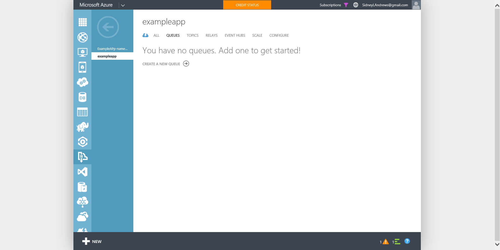

6. Create a new Queue with the name **todo** and leave all other values to their default.

  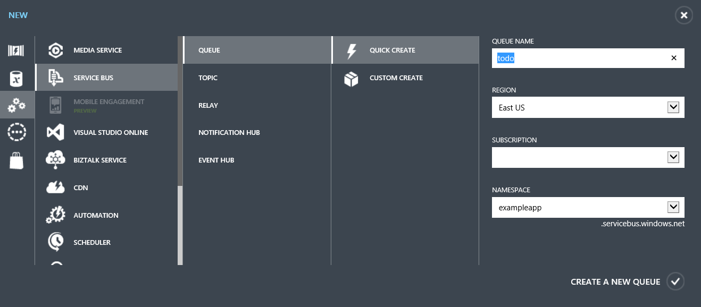

5. Record the connection string to use in later steps.
6. Return to the [Azure Management Portal](https://portal.azure.com).
1. In the Azure portal, locate the jumpbar, click **Browse**, then click **Mobile App** and then locate your exising Mobile App created in the previous exercises.
2. In the Mobile App blade, record the name of your Mobile App instance.
1. Locate the jumbar, click **Browse**, then click **SQL Database** and then locate your existing SQL database created with your Mobile App.
2. In the SQL database blade, record the name of your SQL Database instance.
3. Expand the **Essentials** panel and then click **All settings**.
2. Record the following values for your SQL Database instance:
  * Name of database
  * Server Name
  * Server Admin login
  * Ensure that you also record the password you have used with the database in pervious exercises.
3. Record the full name of your Mobile Service TodoItems table including the schema.  The schema is the name of your Mobile App instance.  For example, if your Mobile App instance's name is **MyMobileApp** than the full name of your table is **MyMobileApp.TodoItems**.
1. In the Azure startboard, select **Marketplace**.
2. Select **API Apps** and search for **Microsoft SQL Connector**.
3. Enter a unique Name.
4. For the App Service Plan select the existing **EndToEnd** plan.
4. Modify the following package settings.  Make sure you replace **NameOfYourMobileApp** with the correct name of your Mobile App (database schema):

Name |  Description
--- | ---
Server Name | Enter the SQL Server name recorded above.
User Name | Enter the user name used for the database.
Password | Enter the password used for the database.
Database Name | Enter the name of the database.
Data Available Query | ```SELECT COUNT(*) FROM [NameOfYourMobileApp].[TodoItems] WHERE Processed = 0```
Poll Data Query | ```SELECT * FROM [NameOfYourMobileApp].[TodoItems] 	WHERE Processed = 0; UPDATE [NameOfYourMobileApp].[TodoItems] SET Processed = 1 WHERE Processed = 0```

  

1. Click **Create** to create the SQL Connector API App instance.
2. In the Azure startboard, select **Marketplace**.
2. Select **API Apps** and search for **Azure Service Bus connector**.
3. Enter a unique Name.
4. For the App Service Plan select the existing **EndToEnd** plan.
4. Modify the following package settings:

Name | Description
--- | ---
Connection String | The connection string recorded from the Service Bus namespace. For example: *Endpoint=sb://[namespace].servicebus.windows.net;SharedAccessKeyName=[name];SharedAccessKey=[key]*.
Entity Name | Enter the value **todo** (the name of your queue).

  

1. Click **Create** to create the Service Bus Connector API App instance.
1. Click on the **+ New** button at the top left of the portal, expand **Web + Mobile**, then click **Logic App**.

 	> This displays the Create logic app view, where you provide some basic settings to get started.

	

2. In **Name** type a meaningful name for your logic app.

3. Choose the **App service plan** you used when creating your connectors: **EndToEnd**.  This should automatically choose the Location, Subscription and Resource Group for you.

4. Click **Create**.

5. Once the Logic App is created, click **Triggers and Actions**.

  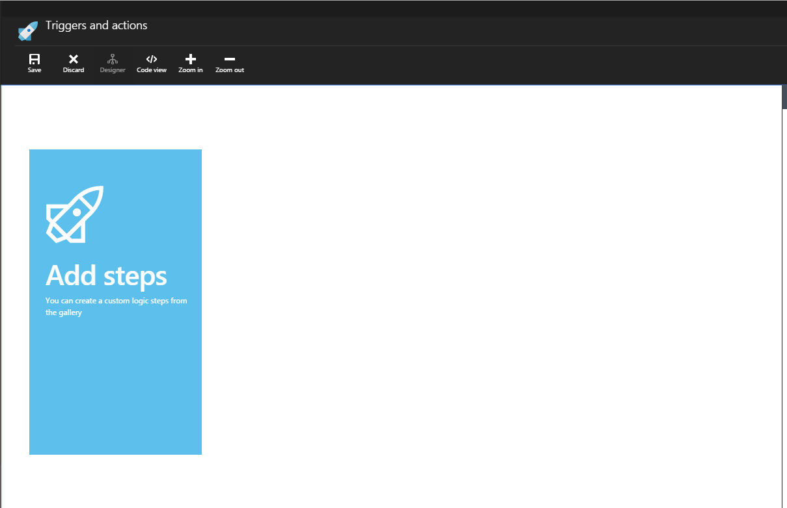

6. On the right-side, you should see a list of Apps available in your App Service Plan.

  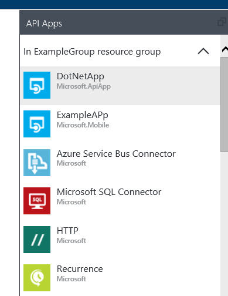

6.  Select the **Microsoft SQL Connector** from the **API Apps** section.  This lists the available triggers: **Poll Data(JSON)** and **Poll Data(XML)**.

  

7. Select the **Poll Data (JSON)** trigger, enter a frequency of **1 minute** and click the checkmark.

  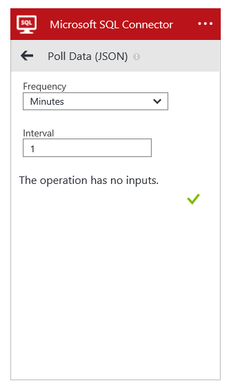

  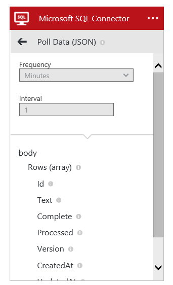

8. Select the only **Microsoft.ApiApp** connector from the **API Apps** section.  This lists the available API operations.

  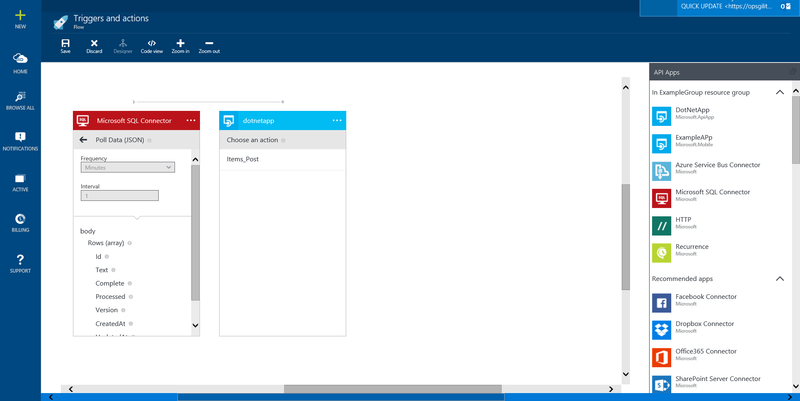

9. Select the **Items_Post** action and then select the **Poll Data (JSON) Text** property for the **Text** field.  Select **true** for the **Complete** field.  Click the checkmark.

  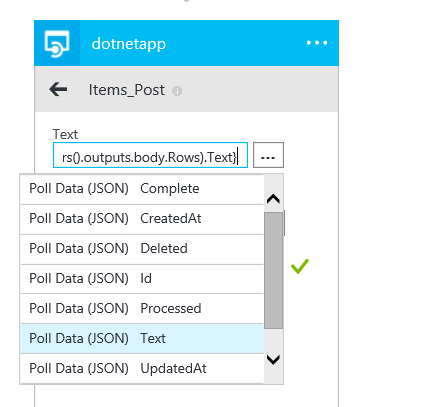

  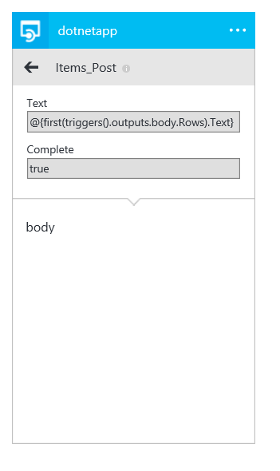

10. Select the **Azure Service Bus Connector** from the **API Apps** section.  This list the available actions.

  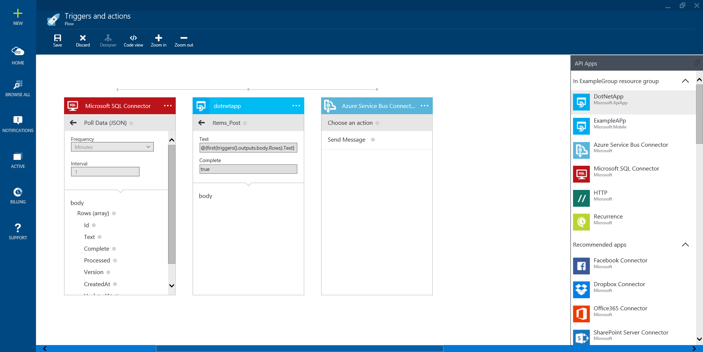

11. Select the **Send Message** action and then select the **Poll Data (JSON) Text** property for the **Text** field.  Click the checkmark.

  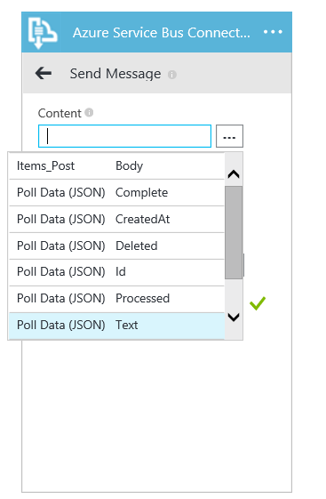

12. Click the **Save** button at the top of the blade.

  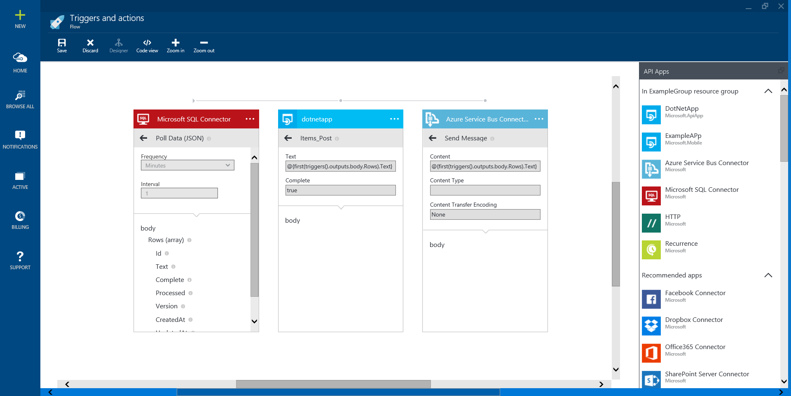

<a name="Exercise4"></a>
## Exercise 4: Creating your Web App & WebJob ##

In this exercise, you will sign up for a Twilio trial account, create an Azure Storage account and then create a WebJob that listens to Service Bus messages, then sends a Text Message for each Service Bus message received.

1. Sign up for a free Twilio Trial at the following URL: https://www.twilio.com/try-twilio.

  

  > When you sign up for a your free Twilio Trial, you be asked to verify your personal phone number. This is an important security step that is mandatory to trying Twilio.

2. Click the **Get your Twilio Number** button after you have verified your phone number.

  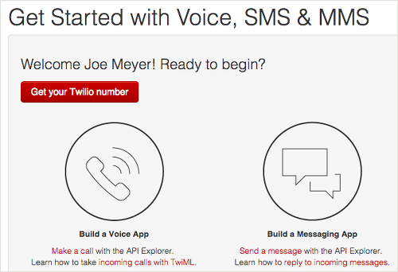

3. A new Twilio number will be generated for your account.  Record the phone number to use in later steps.

  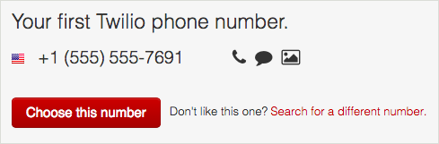

4. While logged in, go to your **Account Settings** page and then locate the **API Credentials** section.

  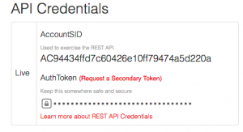

5. Record the **AuthToken** and **AccountSID** values for use with the client libraries.

6. In the Azure portal, click the **New** button in the jumbar, select **Data + Storage** and then select the *8Storage** option.

  

7. In the **Storage account** blade, select a unique name for your Storage instance, ensure that it is in the **EndToEnd** Resource Group and select the **Locally Redundant (Standard-LRS)** replication option.  Click **Create**.

  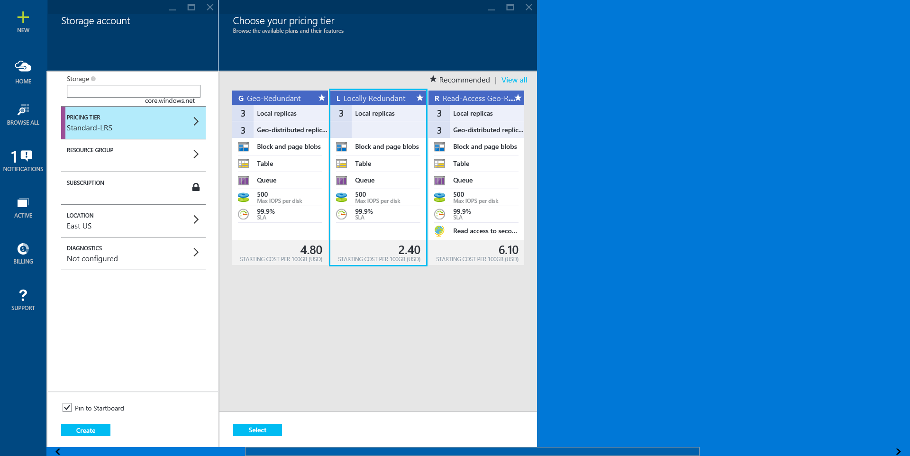

8. Once the Storage Account is created, expand the **Essentials panel**, click the **All Settings** link and then click **Keys**.

9. Record the **Primary Connection String** for your storage account.

2. Click the **+ NEW** icon on the top left of the portal

3. Click **Web + Mobile**, then **Web app**.

    

4. Enter any unique value for **URL**.

5. Select the existing **EndToEnd** App Service plan.

    

6. Click **Create**.

7. Once the status changes to **Running**, the portal will automatically open the blade for your web app. You can also reach the blade by clicking **Browse**.

	

8. Expand the Essentials Panel and click the **All Settings** link.

9. Click the **Application Settings** option.

10. Scroll down and locate the **Connection Strings section**.

11. Add a custom connection string with the following values:

  * **Name**: AzureWebJobsDashboard
  * **Value**: The storage account connection string recorded earlier in this exercise.

12. Open **Visual Studio**.

13. Click **File** > **New Project**, and then in the **New Project** dialog box click **Cloud** > **Microsoft Azure WebJob**.

  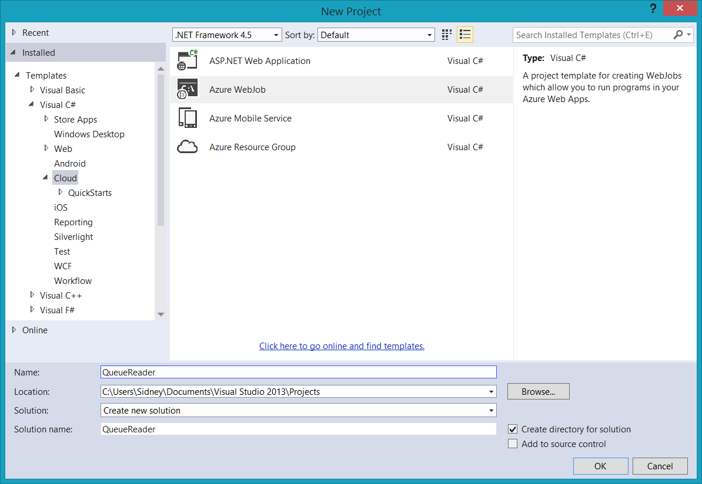

14. Name the project **QueueReader** a name and then click **OK**.

5. In Solution Explorer, right-click the project and then click **Manage NuGet Packages**.

6. In the **Search Online** box, type **WebJobs ServiceBus**.

  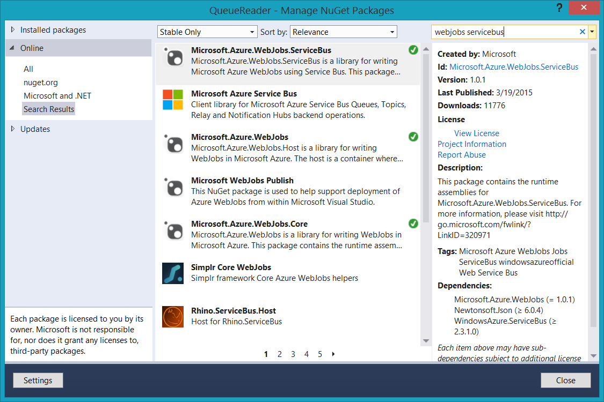

7. From the results, install the **Microsoft.Azure.WebJobs.ServiceBus** package. This will download and install the WebJobs Service Bus package as well as all dependencies.

8. In the **Search Online** box, type **Twilio**.

  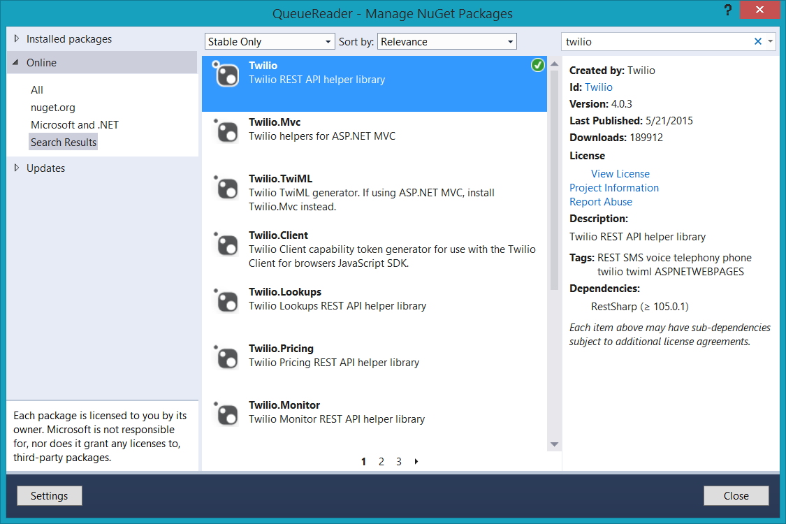

9. From the results, install the **Twilio** package. This will download and install the Twilio REST API package as well as all dependencies.

10. Open the application **App.confg** file in the project.

11. Locate the ```<connectionStrings>``` section in the configuration file and replace the entire section with the following XML:

        <connectionStrings>
             <add name="AzureWebJobsDashboard" connectionString="DefaultEndpointsProtocol=https;AccountName=[accountname];AccountKey=[accesskey]"/>
             <add name="AzureWebJobsStorage" connectionString="DefaultEndpointsProtocol=https;AccountName=[accountname];AccountKey=[accesskey]"/>
             <add name="AzureWebJobsServiceBus" connectionString="Endpoint=sb://[yourServiceNamespace].servicebus.windows.net/;SharedAccessKeyName=RootManageSharedAccessKey;SharedAccessKey=[yourKey]"/>
         </connectionStrings>

12. Replace the **connectionString** values for the **AzureWebJobsDashboard** and **AzureWebJobsStorage** entries with the connection string previously recorded for the new Storage Account earlier in this exercise.

13. Replace the **connectionString** value for the **AzureWebJobsServiceBus** entry with the connection string previously recorded for the Service Bus namespace earlier in a previous exercise.

14. Open the **Functions.cs** file.

15. Within the existing namespace, replace the entire **Functions** class with the following code:

  > It is important that you keep the namespace intact as the namespace will vary if you used a different name for your project.

        using Microsoft.Azure.WebJobs;
        using Twilio;
        using Microsoft.ServiceBus.Messaging;

        public class Functions
        {
            static string AccountSid = "--AccountSID--";
            static string AuthToken = "--AuthenticationToken--";
            static string FromNumber = "+15551234567";
            static string ToNumber = "+15559876543";
        }

16. Replace the **FromNumber** variable's value with the number from your Twilio account recorded earlier in this exercise.  Make sure you precede this number with the appropriate country extension (Example: in the US you would prefix with *+1*).

17. Replace the **ToNumber** variable's value with your personal phone number.  Make sure you precede this number with the appropriate country extension (Example: in the US you would prefix with *+1*).

18. Replace the **AccountSid** variable's value with the Account SID from your Twilio account recorded earlier in this exercise.

19. Replace the **AuthToken** variable's value with the Authentication Token from your Twilio account recorded earlier in this exercise.

20. Add a new method to the **Functions** class using the following code:

        public static void ProcessServiceBusQueueMessage([ServiceBusTrigger("todo")] BrokeredMessage todoMessage)
        {
            var twilio = new TwilioRestClient(AccountSid, AuthToken);

            string todoString;
            using (Stream stream = todoMessage.GetBody<Stream>())
            {
                StreamReader reader = new StreamReader(stream);
                todoString = reader.ReadToEnd();
            }

            string textMessage = String.Format("Todo Item Created: {0}", todoString);
            twilio.SendMessage(FromNumber, ToNumber, textMessage);
        }

21. Right-click the project in Solution Explorer and click **Publish as Azure WebJob**.

  

22. Name your WebJob **QueueReader**.

  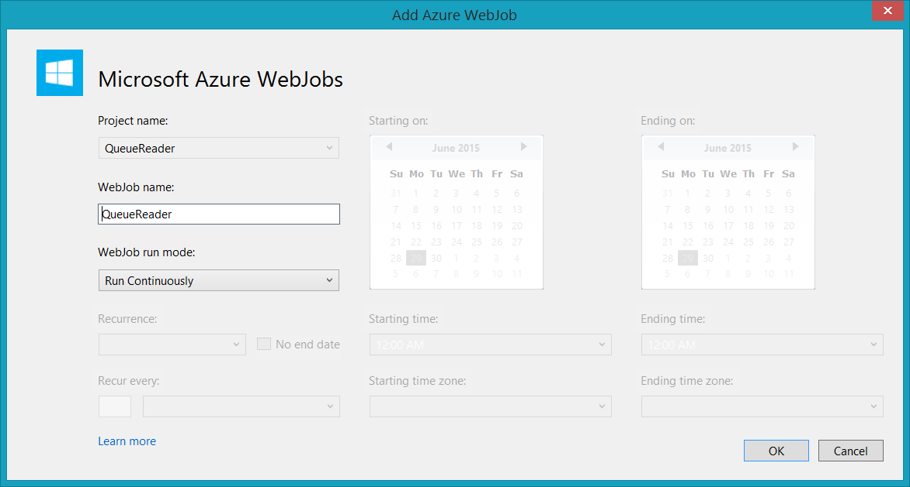

23. Select **Microsoft Azure Web Apps** as your publish target.

  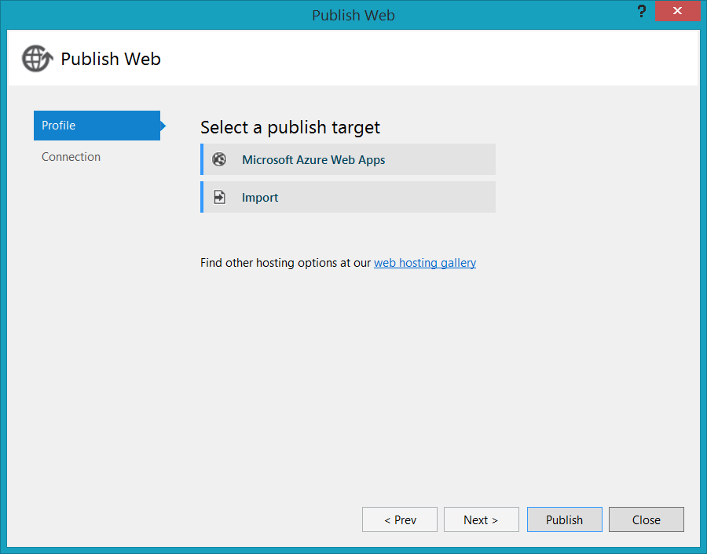

24. Select your previoulsy created Web App from the **Existing Web Apps** list.

  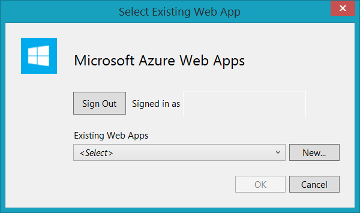

25. Click **Publish**.

<a name="Exercise5"></a>
## Exercise 5: Test Your Solution ##

In this exercise, you will validate that your App Service created in previous exercises.

1. Open the auto-generated Visual Studio project with the prefix **_Windows_CS**.

2. Use **F5** to debug and run the Windows Store app.

  

3. Add a new item to the Todo Items list and click **Save**.

  > Sometimes the initial download of items may take a couple of extra seconds.  The **Save** and **Refresh** buttons are not available until this is done.

4. Stop the debugging of the Windows Store application.

5. Within 5 minutes, you should receive a text message alerting you that a Todo Item has been processed by your workflow.

> Feel free to explore the SQL Database instance and DocumentDB instances so that you can see the stored versions of your Todo Item while they are being processed.  You can also view the Dashboard for the QueueReader WebJob to watch it process your items asynchronously.  Finally, you can view your recent Runs in your Logic App instance to see when it was triggered and how it was triggered.
